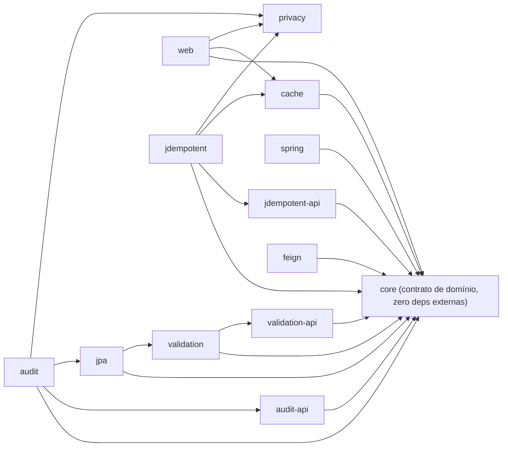

# Architecture Spine — SawCunhaOS-Foundation 1.2.0

## Design Paradigm

**Layered modular library.** Cada módulo é um artefato Maven publicável isoladamente (Maven Central via Sonatype); a direção de dependência é sempre de fora para dentro — `core` não depende de nada do reactor, módulos `*-api` só carregam contrato (`@interface`/`enum`), módulos de implementação dependem de `core`/`*-api`, módulos "folha" (`web`, `jpa`, `cache`, `feign`) dependem de tudo que precisam mas nada depende deles exceto aplicações consumidoras. Comportamento transversal (auditoria, idempotência, tratamento de erro) entra via autoconfiguração condicional do Spring (`AutoConfiguration.imports` + `@ConditionalOnProperty`/`@ConditionalOnMissingBean`), nunca por herança ou instanciação direta — um consumidor liga um módulo importando a dependência, não escrevendo código de integração.

## Invariants & Rules

### AD-1 — Fronteira e direção de dependência entre módulos [ADOPTED]

- **Binds:** FR-18, FR-19, FR-20, FR-23
- **Prevents:** ciclo entre módulos, `core` ou `*-api` importando Spring/JPA/Servlet, um módulo "sem casa" recriando o antipadrão `utils.utils`, classe órfã sem destino declarado
- **Rule:** grafo de dependência é o da tabela abaixo; `core` não importa `org.springframework`/`jakarta.persistence`/`jakarta.servlet`; `spring` não importa `jakarta.servlet`/`jakarta.persistence`/`spring.data`; `*-api` não importa nada além de `jakarta.validation-api`; nenhum módulo além de aplicações depende de `web`; nenhuma classe das 71 atuais do `utils` fica sem módulo de destino (inventário congelado na Fase 0).



`web → privacy` é aresta real, não hipotética: `LoggingInitialFilter`/`LoggingFinalFilter` (hoje em `utils`) importam `jakarta.servlet.*` + `OncePerRequestFilter` **e** `SanitizationBodyComponent`/`SanitizationHeadersComponent` de `privacy` — só cabem em `web` pelas regras deste AD, e a regra ArchUnit de AD-5 nasce já sabendo disso, em vez de bloquear a extração na Fase 0.

### AD-2 — Contrato de aquisição de idempotência [ADOPTED]

- **Binds:** FR-1, FR-2, FR-4, FR-25 a FR-29, NFR-6
- **Prevents:** corrida não-atômica (`contains → store → setResponse`), duplicidade silenciosa sob concorrência, indisponibilidade do Redis travando negócio (fail-closed), duplicidade não coberta quando o Redis está fora
- **Rule:** aquisição de lock só acontece via `tryAcquire(key, payloadHash, ttl) → Lease`, atômico (Lua script sobre Redis). Falha do Redis é sempre fail-open (nunca `FAIL_CLOSED`), protegida por circuit breaker (`resilience4j-spring-boot4`, ver Stack). A garantia de não-duplicidade sob fail-open **não** é responsabilidade do `jdempotent` — é da constraint `UNIQUE` do banco na tabela de destino (pré-requisito documentado, não recomendação, ver NFR-6). `jdempotent` é fast-path, nunca a única barreira. **Forma do contrato, não só a operação**: `key` é sempre resolvida por um único `IdempotencyKeyResolver` (FR-8) — o path HTTP (aspecto sobre `@Jdempotent`) e o path de mensageria (listener) chamam o mesmo resolver, nunca reimplementam a composição de chave por conta própria. `ttl` do `Lease` é sempre `java.time.Duration`, nunca um `long` cru em unidade implícita — evita um entrypoint tratar como segundos e outro como milissegundos.

### AD-3 — Separação contrato de domínio × tradução HTTP [ADOPTED]

- **Binds:** FR-9 a FR-17, FR-34
- **Prevents:** módulo de domínio (`core`) carregando `spring-web`, exceptions de negócio conhecendo formato HTTP, handler duplicado/order errado mascarando status code real
- **Rule:** `ScosException`/`ExceptionCode`/`ScosExceptionCode`/`LocaleService` (contrato) vivem em `core`, sem import de Spring. `ExceptionsHandler`/`ScosProblemDetails`/`ScosFieldError` (tradução HTTP) vivem em `web`, registrados via `AutoConfiguration.imports` com `@ConditionalOnProperty(matchIfMissing=true)` e `@Order(LOWEST_PRECEDENCE)`. `AccessDeniedException` (Spring Security, novo) e `AuthorizationDeniedException` (path antigo) são handlers distintos lado a lado — nunca um substituindo o outro.

### AD-4 — Piso de documentação obrigatório, repo inteiro

- **Binds:** `all` (todo módulo, incluindo `audit` e `privacy`, não tocados funcionalmente pelo PRD 1.2.0)
- **Prevents:** API pública sem Javadoc, módulo publicado sem README, lógica não-óbvia sem explicação, guia de integração desatualizado em relação ao código
- **Rule:**
  1. **Javadoc** em toda API pública (`scope=public`, métodos com 2+ linhas) e em todo tipo com visibilidade `protected` ou mais aberta — mecanicamente cobrado por Checkstyle (`MissingJavadocMethod`/`MissingJavadocType`, já configurado em `etc/devops/checkstyle/checkstyle.xml`), promovido do perfil `analyze` de 4 dos 5 módulos atuais para `pluginManagement` do POM pai, cobrindo 100% dos módulos existentes e futuros (mesmo veículo do AD-5/FR-20) — inclui `privacy`, hoje sem o perfil.
  2. **Comentário inline** onde a lógica não é óbvia a partir do código (decisão não-trivial, workaround, invariante escondida) — cobrado em code review, sem gate mecânico (não existe ferramenta de lint para "não-óbvio"). Risco residual aceito conscientemente: é o mesmo modo de enforcement ("disciplina de review, fácil de esquecer sob pressão") que o AD-5 lista como o que quer evitar para boundary de módulo — aqui não há alternativa mecânica, então o custo fica com a revisão humana por decisão, não por omissão.
  3. **Diagrama de fluxo de uso em Mermaid inline** no `README.md` de cada módulo, mostrando a sequência típica de uso do módulo por um consumidor — nenhum módulo tem hoje.
  4. **README obrigatório por módulo** — hoje ausente em `exception`, `jdempotent`, `utils` e em todos os módulos novos do F3; `audit`/`privacy` já têm, ganham só o diagrama.
  5. Este piso **bloqueia o release da 1.2.0** (decisão explícita do usuário, válida por si só) — não é item de backlog. Essa decisão de bloqueio independe do mecanismo automático de gate: mesmo que o `failOnViolation` do Checkstyle não esteja de fato amarrado (ver verificação pendente abaixo), a ausência de Javadoc/README/diagrama continua bloqueando o release por checagem manual, até o gate mecânico ser confirmado ou implementado.

  **Verificação pendente antes de confiar neste gate**: o `maven-checkstyle-plugin` está configurado (`configLocation`) nos 4 módulos, mas a execução com `goal=check` não está visível localmente — pode estar amarrada via `pluginManagement` do `scos-bom` (parent externo, não inspecionado nesta run) ou pode não estar de fato falhando o build hoje. Confirmar com `mvn -Panalyze verify` antes de depender disso como gate único; se não estiver amarrado, adicionar a execução `check` com `failOnViolation=true` na mesma promoção a `pluginManagement` do AD-5.

### AD-5 — ArchUnit como mecanismo de imposição das regras de módulo [ADOPTED]

- **Binds:** FR-19, FR-20
- **Prevents:** regra de boundary virando disciplina de code review (fácil de esquecer sob pressão), ou todas as regras chegando só no fim da decomposição — deixando `core` e os `*-api` (os mais sensíveis ao acoplamento invertido) sem proteção durante sua própria extração
- **Rule:** `com.tngtech.archunit:archunit-junit5:1.5.0` (versão atual verificada, ago/2026), escopo `test`, no perfil `analyze` promovido a `pluginManagement` do POM pai. Cada regra ArchUnit nasce no mesmo commit que cria o módulo que ela protege (`core` ganha sua regra "não importa Spring" na Fase 3, `*-api` ganham a deles na Fase 2) — nunca todas de uma vez ao final. **Regras que citam mais de um módulo** (ex.: "nenhum módulo além de aplicações depende de `web`") não pertencem a nenhum módulo de implementação individual — nenhum deles enxerga o classpath inteiro sozinho. Essas regras vivem em um módulo de teste dedicado `archtest` (novo, `scope=test`, sem código de produção, depende de todos os outros só para teste), nasce junto com a Fase 2 (primeira vez que existe mais de um módulo pra checar) e ganha uma classe de teste por regra cross-módulo — nunca duplicada dentro de um módulo de implementação.

## Consistency Conventions

| Concern | Convention |
| --- | --- |
| Nomes de pacote (raiz) | `br.com.sawcunhaos.foundation.<módulo>` (ex.: `.core`, `.web`, `.cache`) — sem agregador `deprecated`, sem período de depreciação (SNAPSHOT, nada publicado sob 1.2.0 ainda) |
| Sub-pacote interno ao módulo | Segue exatamente o nome/pacote já fixado no inventário classe→módulo congelado na Fase 0 (FR-23, detalhado no addendum do PRD) — nenhuma classe migrada ganha nome ou sub-pacote diferente do inventário. Classe nova segue o padrão do vizinho mais próximo no mesmo sub-pacote; sem sub-pacote "genérico" tipo `util`/`common` dentro de `core` (repetiria o antipadrão que motivou a decomposição) |
| Hashing | `HashUtils` via enum `CryptographyAlgorithm`, SHA-256 (não MD5), hex via `HexFormat.of().formatHex()` (não `Integer.toHexString`) |
| Serialização JSON | Jackson (`tools.jackson.*`, Jackson 3) em toda a base — `GsonUtils` e adapters removidos; `@JsonInclude` documentado onde a política de nulos importa (diverge do comportamento antigo do Gson) |
| Erro HTTP | `ScosProblemDetails` (RFC 7807), log por faixa: 4xx `WARN` sem stack trace, 5xx `ERROR` com stack trace, `ScosNoContentException` (204) em `DEBUG`; `@Slf4j` em todo módulo (nunca Log4j2 direto) |
| Configuração | `@ConfigurationProperties` (nunca `@Value` solto); registro de auto-configuração via `AutoConfiguration.imports`, nunca `spring.factories` |
| Métricas | Interface própria por capability (`IdempotencyMetrics`) com implementação no-op por padrão, Micrometer condicional — nunca acoplar direto ao Micrometer |

## Stack

| Name | Version |
| --- | --- |
| Java | 25 |
| Maven multi-módulo | herdado de `scos-bom` (parent) `1.3.1`, que importa `spring-boot-dependencies:4.1.0` e `spring-cloud-dependencies:2025.1.2` (confirmado lendo o POM em cache local, `~/.m2`) |
| Spring Boot | `4.1.0` (via `scos-bom`, confirmado) |
| Jackson | `jackson-bom:3.2.1` (via `scos-bom`, confirmado — `tools.jackson.*`, bate com Jackson 3 do FR-14/FR-21) |
| ArchUnit (novo) | `archunit-junit5` `1.5.0` (escopo `test`) — única dependência nova de teste |
| Resilience4j (novo) | `io.github.resilience4j:resilience4j-spring-boot4:2.4.0` — **não gerenciado por `scos-bom` nem pelos BOMs que ele importa** (confirmado: nenhuma entrada `resilience4j` em nenhum dos três). Artefato correto é `-spring-boot4`, não `-spring-boot3` (Spring Boot real do projeto é 4.1.0); versão precisa ser fixada explicitamente no módulo `jdempotent`, não herdada |
| Checkstyle | já presente em `etc/devops/checkstyle/checkstyle.xml`, versão do plugin herdada do `scos-bom` |
| Jacoco | já presente no perfil `analyze`, mínimo 80% nas áreas tocadas pela Fase 0 do F1 (NFR-3) |

## Structural Seed

```text
scos-foundation/
  privacy/                    # leaf, sem mudança funcional — ganha checkstyle+README com diagrama
  archtest/                   # NOVO — regras ArchUnit cross-módulo (scope test, sem código de produção), nasce na Fase 2
  core/                       # NOVO — contrato puro (ScosException, ExceptionCode, LocaleService, DateUtils, HashUtils...), zero Spring
  audit-api/                  # NOVO — contrato @Auditable, sem lógica
  jdempotent-api/             # NOVO — contrato @Jdempotent*, sem lógica
  validation-api/             # NOVO — contrato de validação, sem lógica
  spring/                     # NOVO — ScosRule, aspectos genéricos
  validation/                 # NOVO — Cpf/Cnpj/Email/TaxIdentifier (value objects), jakarta.persistence-api provided
  cache/                      # NOVO — PolymorphicRedisSerializer + config
  jpa/                        # NOVO — SpecificationRepository, BaseEntity
  web/                        # NOVO — ScosController, ExceptionsHandler (via AutoConfiguration.imports), @Cacheable embutido
  feign/                      # NOVO — JacksonEncoderCustom/DecoderCustom
  utils/                      # some ao final da Fase 5 (reactor removido)
  exception/                  # extinto (FR-11) — conteúdo migra para core + web
  audit/                      # dependência repontada de exception → core
  jdempotent/                 # consumidor de core + jdempotent-api + cache + privacy
```

## Capability → Architecture Map

| Capability / Área | Vive em | Governado por |
| --- | --- | --- |
| F1 — Idempotência (FR-1..8, FR-25..33) | `jdempotent` (+ `jdempotent-api` para as anotações) | AD-2, AD-1 |
| F2 — Exceção/HTTP (FR-9..17, FR-34) | `core` (contrato) + `web` (tradução) | AD-3, AD-1 |
| F3 — Decomposição `utils` (FR-18..24) | `core`, `spring`, `validation(-api)`, `cache`, `jpa`, `web`, `feign`, `audit-api` | AD-1, AD-5 |
| Piso de documentação (pedido do usuário) | todo módulo | AD-4 |

## Deferred

- **Versionamento pós-1.2.0** (quando sair de `SNAPSHOT` para release real, cadência subsequente) — decisão de negócio fora desta spine; PRD também não fixa data.
- **Dimensionamento de timeout/circuit breaker por ambiente** (OQ-3 do PRD) — cabe ao time consumidor em cada ambiente, não a esta spine.
- **Módulo `-api` companheiro para `privacy`/`web`/`spring`** — critério já registrado no addendum do PRD; nenhuma anotação atual justifica, revisitar só se surgir consumidor de domínio puro real.
- **Portal de documentação centralizado além dos READMEs por módulo** — não pedido, README+Mermaid por módulo já cobre o piso combinado.
