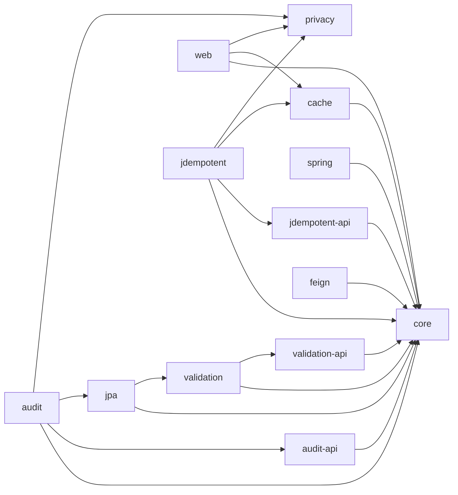
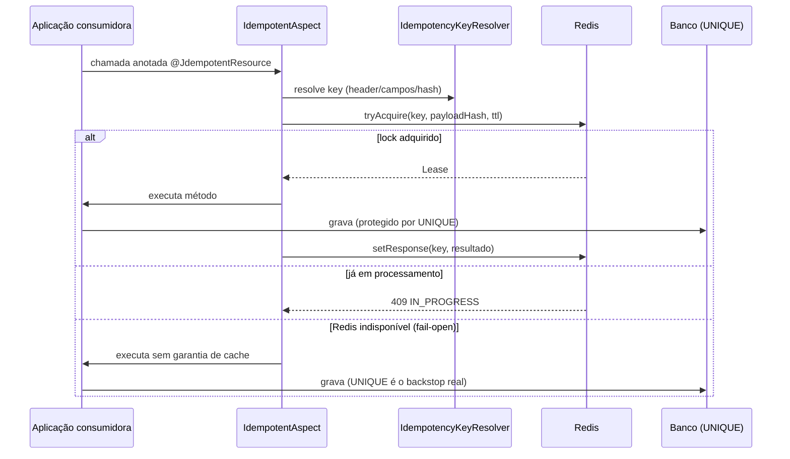

# Guia de Implementação — Arquitetura SawCunhaOS-Foundation 1.2.0

Este documento existe para ajudar quem for **executar o PRD 1.2.0** a entender o porquê por trás de cada invariante da [`ARCHITECTURE-SPINE.md`](./ARCHITECTURE-SPINE.md) — a spine é terse de propósito (decisões, não raciocínio); este guia carrega o raciocínio. Não repita a spine aqui: se um `AD` mudar, mude lá; este documento só explica.

## 1. Por que "layered modular library" e não outra coisa

O repositório já é isso na prática — cada módulo (`privacy`, `utils`, `exception`, `audit`, `jdempotent`) é um artefato Maven Central separado, com dependência sempre em uma direção. O PRD 1.2.0 não muda o paradigma, **completa** ele: hoje `utils` é um monólito que todo mundo depende, e `exception`→`audit` é acoplamento invertido (um módulo de auditoria carregando `spring-web`/`spring-security-core` sem precisar). A spine só nomeia o que o código já está tentando ser e fecha os buracos (`core` sem Spring, `*-api` sem lógica, nada depende de `web` exceto app).

**Alternativa que foi descartada**: reescrever como microsserviços ou plugins dinâmicos. Não fazia sentido — é uma biblioteca consumida por outras aplicações Spring Boot, não um sistema deployado; a "fronteira" que importa é de import/dependência Maven, não de rede.

## 2. O grafo de dependência (AD-1) — leia isto antes de mover qualquer classe

A aresta `web → privacy` não é teórica: `LoggingInitialFilter`/`LoggingFinalFilter` (hoje em `utils`) importam `jakarta.servlet` **e** os componentes de sanitização do `privacy` ao mesmo tempo — elas só cabem em `web`. Se você estiver na Fase 0/1 (inventário congelado do FR-23) e achar uma classe parecida com essas duas, ela vai para `web`, não para `spring`.

**Onde colocar uma classe nova ou migrada**: primeiro confira o inventário classe→módulo do addendum do PRD (`_bmad-output/.../addendum.md`); se não estiver lá, use o vizinho mais próximo do mesmo sub-pacote como referência de nome — nunca crie um sub-pacote genérico tipo `util`/`common` dentro de `core` (é exatamente o antipadrão que motivou a decomposição).

## 3. `archtest` — o módulo novo que a spine adicionou

O PRD já pedia ArchUnit (FR-19/FR-20), mas não dizia *onde* rodar as regras que citam mais de um módulo (ex.: "nada depende de `web`") — nenhum módulo de implementação enxerga o classpath inteiro sozinho para se autoverificar. A spine resolve isso com um módulo novo, `archtest`, `scope=test`, sem código de produção, que nasce na Fase 2 (primeira vez que existe mais de um módulo novo pra checar) e cresce uma classe de teste por regra cross-módulo. Regras que dizem respeito a um módulo só (ex.: "`core` não importa Spring") continuam nascendo dentro do próprio módulo, no mesmo commit que o cria — isso não muda.

## 4. Idempotência (AD-2) — o que muda além do que o PRD já disse

O PRD já define `tryAcquire(key, payloadHash, ttl) → Lease` e fail-open. A spine acrescenta uma garantia de **forma**, não só de operação: tanto o aspecto HTTP (`@JdempotentResource`) quanto um futuro listener de mensageria têm que passar pelo mesmo `IdempotencyKeyResolver` (FR-8) para montar a `key` — nunca reimplementar a composição por conta própria em cada entrypoint. E `ttl` no `Lease` é sempre `Duration`, nunca um `long` cru — evita a armadilha clássica de um lugar tratar como segundos e outro como milissegundos, silenciosa até o dia em que o lease expira 1000x mais rápido que o esperado.

**Circuit breaker real**: o PRD cita Resilience4j (FR-4) mas não fixa artefato/versão. A pesquisa desta run achou algo que vale a pena registrar aqui porque é fácil de errar: o `scos-bom:1.3.1` puxa `spring-boot-dependencies:4.1.0` (Spring Boot 4, não 3), e o artefato certo para Spring Boot 4 é `resilience4j-spring-boot4` (não o `-spring-boot3`, que é o que a maioria dos tutoriais/exemplos ainda mostra em 2026). Versão: `2.4.0`. Nenhum BOM do projeto gerencia isso — precisa declarar a versão explicitamente no `pom.xml` do `jdempotent`.

## 5. O piso de documentação (AD-4) — o pedido que motivou esta run

Este é o único AD que não vem do PRD — foi pedido explicitamente nesta conversa. Resumo prático de quatro exigências e como cada uma é cobrada:

| Exigência | Cobrança | Onde já existe / falta |
| --- | --- | --- |
| Javadoc em API pública | Mecânica — Checkstyle (`MissingJavadocMethod`/`MissingJavadocType`), promovido a `pluginManagement` | Já ativo em `jdempotent`/`audit`/`utils`/`exception`; falta em `privacy` (24 classes já têm Javadoc informal, só falta ligar o gate) |
| Comentário onde a lógica não é óbvia | Review — não existe lint para "não-óbvio" | Novo, sem estado atual — critério é julgamento do revisor |
| Diagrama de fluxo Mermaid no README | Review — checklist de PR | Nenhum módulo tem hoje, nem `audit`/`privacy` |
| README por módulo | Review — checklist de PR | `audit`/`privacy` têm; `exception`, `jdempotent`, `utils` e todo módulo novo do F3 não têm |

**Importante para quem for configurar o CI**: confirme antes de contar com isso como gate automático — rode `mvn -Panalyze verify` num módulo que já tem o perfil (ex.: `jdempotent`) e veja se o build realmente falha quando um método público sem Javadoc é introduzido. O `maven-checkstyle-plugin` está configurado nos poms, mas a execução com `goal=check` não foi encontrada localmente — pode estar no `pluginManagement` do `scos-bom` (não inspecionado nesta run) ou pode não estar de fato amarrada. Enquanto isso, o bloqueio de release vale por checagem manual — a decisão de bloquear não depende do gate estar automatizado.

**Exemplo de diagrama de fluxo esperado** (o que teria ido no README do `jdempotent`, por exemplo):

## 6. Crosswalk com o Sequenciamento do PRD

A spine não redefine a ordem — a tabela `## Sequenciamento e Fases` do PRD continua sendo a fonte da verdade (NFR-1). O que muda por causa desta spine:

- **Fase 2** (criação dos `*-api`) ganha também a criação do `archtest`.
- **Fase 3** (extração do `core`) é onde a primeira regra ArchUnit real nasce (`core` não importa Spring), junto com a extração.
- **Fase 4/5** (módulos folha) é onde `web` ganha a aresta para `privacy` — não esqueça `LoggingInitialFilter`/`LoggingFinalFilter` no inventário da Fase 0 se ainda não estiverem lá.
- Toda fase que criar ou tocar um módulo agora também exige: Javadoc no que for público, README com diagrama Mermaid, e (para `privacy`, mesmo sem mudança funcional) ligar o perfil `analyze`/Checkstyle.

## 7. Divergência em relação ao PRD que vale reportar

O PRD 1.2.0 não tem NFR nem estimativa de esforço cobrindo o piso de documentação, e a decisão de que ele **bloqueia o release** é nova desta conversa — não estava no PRD original. Recomendação: levar essa divergência de volta ao PRD (novo NFR + ajuste da estimativa de 21-28 dias) antes de considerar os dois documentos como fonte única da verdade, para não divergirem silenciosamente.
