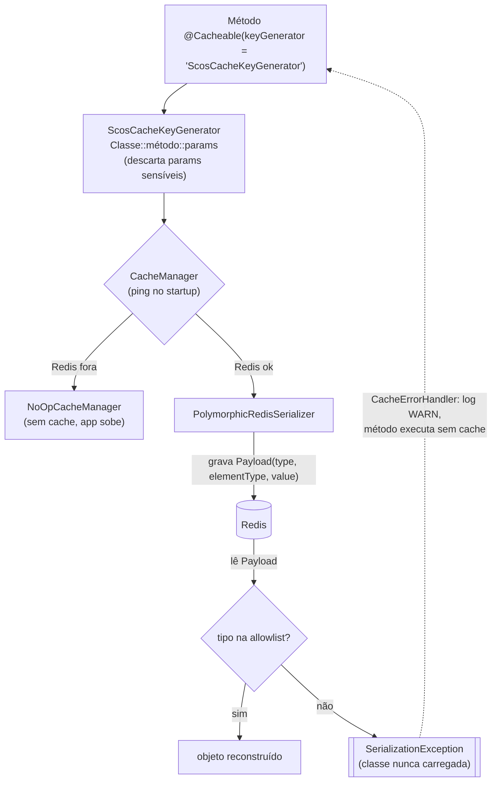

# scos-foundation-cache

Configuração de cache Redis para aplicações SCOS: `ScosCacheConfiguration` (conexão Lettuce,
`CacheManager`, tratamento de erro), `ScosCacheKeyGenerator`, `PolymorphicRedisSerializer` e as
propriedades `scos.cache.*`. Existe para quem só quer cache Redis **sem herdar JPA** (antes essas
classes viviam em `utils`). Depende de `core`, `spring-boot-starter-cache` e
`spring-boot-starter-data-redis`.

---

## Fluxo típico de uso

---

## `PolymorphicRedisSerializer` e a allowlist

Grava um envelope Smile `{type, elementType, value}` com o nome da classe concreta e o reconstrói
na leitura. Como o nome vem do Redis, a desserialização só resolve (`Class.forName`) tipos
permitidos; qualquer outro vira `SerializationException` **antes** de a classe ser carregada
(Story 3.16).

| Permitido por padrão | Observação |
|---|---|
| `br.com.sawcunhaos.*` | pacote de todos os módulos do ecossistema |
| `java.math.*`, `java.time.*`, `java.util.*` | `BigDecimal`, datas, coleções, `Optional`, `UUID` |
| `java.lang.String` | único tipo de `java.lang` (liberar o pacote permitiria `Thread` etc.) |
| arrays | primitivos; de objeto só se o componente for permitido; uma dimensão |
| nomes passados a `new PolymorphicRedisSerializer(Set.of("com.x.Foo"))` | únicos caminho para tipos de terceiros |

`ScosCacheConfiguration` usa o construtor sem argumentos: para cachear um tipo fora da lista, defina
um `RedisCacheConfiguration` próprio com o construtor que recebe os tipos extras.

Coleções cujos elementos não nulos têm uma única classe concreta guardam `elementType` para
voltarem como `List<Foo>` e não como lista de mapas; coleções vazias ou heterogêneas voltam como
contêiner cru.

---

## Propriedades (`scos.cache.*`)

| Propriedade | Padrão | Efeito |
|---|---|---|
| `redis-time-to-live` | `3600` | TTL (s) dos caches sem entrada própria |
| `key-prefix` | — | prefixo `<prefixo>:` no nome de todos os caches |
| `caches[].name` / `time-to-live-seconds` | — | TTL próprio por cache |
| `enable-compression`, `compression-threshold`, `caches[].allow-null-values`, `caches[].max-size`, `caches[].description` | — | **declaradas mas sem efeito hoje** |

A conexão vem de `spring.data.redis.*`: Sentinel se houver bloco `sentinel`, senão Cluster se houver
`cluster`, senão Standalone. `spring.cache.enabled=false` desliga o módulo.

---

## Comportamentos a conhecer

- **Fallback decidido no startup:** se o `ping` falhar, o app sobe com `NoOpCacheManager` e só
  volta a cachear após reinício.
- **Erros em runtime** (get/put/evict/clear) são logados em WARN e engolidos; um `evict` que falha
  deixa dado velho até o TTL.
- **`null` nunca é cacheado.**
- **Chave:** parâmetros com `bearer/token/authorization/password/secret/jwt/apikey/api-key` no
  `toString()` (substring, sem diferenciar maiúsculas) são **removidos** da chave, então chamadas
  que só diferem nesse parâmetro compartilham a mesma entrada; parâmetros > 200 caracteres viram
  `hash_<hashCode>` (colisões possíveis).
