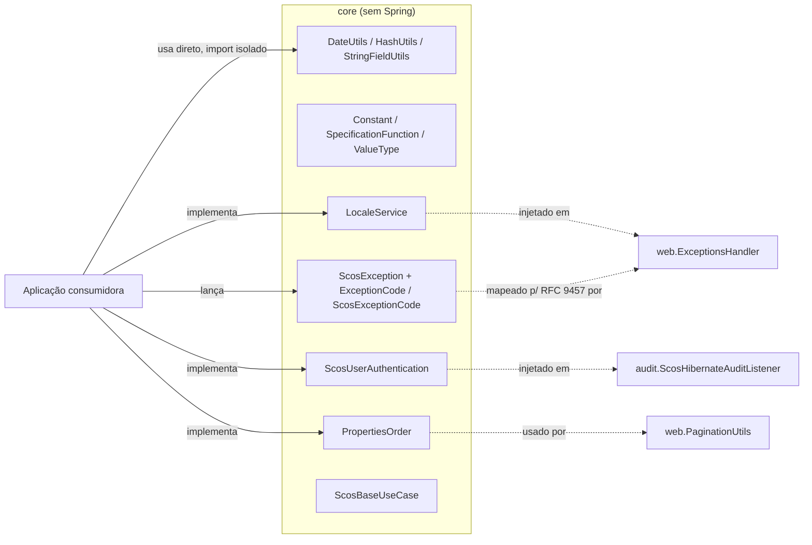

# scos-foundation-core

Módulo zero-Spring do ecossistema SCOS: utilitários de data/hash/string sem nenhuma dependência
de framework, mais o contrato de exceção de domínio (RFC 9457) e as interfaces (`specification`)
que módulos como `audit` e `web` implementam para se conectar à aplicação consumidora. Uma regra
ArchUnit local (`ArchitectureTest#noSpringNoJpaNoServlet`) barra qualquer classe deste módulo de
depender de `org.springframework..`, `jakarta.persistence..` ou `jakarta.servlet..`.

---

## Fluxo típico de uso



Um consumidor pode importar `core` isoladamente e usar só os utilitários e enums (`DateUtils`,
`HashUtils`, `StringFieldUtils`, `Constant`, `SpecificationFunction`, `ValueType`) sem carregar
Spring, JPA ou Servlet. Ao subir uma aplicação Spring completa, os módulos `web`/`audit` esperam que
a aplicação implemente os contratos de `specification` (`LocaleService`, `ScosUserAuthentication`,
`PropertiesOrder`) e injete-os como beans; `ScosBaseUseCase` é um contrato genérico opcional, sem
nenhum uso interno hoje.

---

## Dependência

```xml
<dependency>
    <groupId>br.com.sawcunhaos</groupId>
    <artifactId>scos-foundation-core</artifactId>
</dependency>
```

---

## Utilitários (sem Spring)

```java
DateUtils.isDateValid(29, 2, 2028);      // true (2028 é bissexto) — usa LocalDate.of, sabe o ano
DateUtils.isDateValid(29, 2);            // true sempre — sem ano, não valida bissexto
DateUtils.returnDate(LocalDate.now());   // "2026-09-15"

HashUtils.createHash(cpf);               // SHA-256 puro — checksum/idempotência, NÃO pseudonimiza
HashUtils.pseudonymize(cpf, secret);     // HMAC-SHA256 com chave — pseudonimização válida p/ LGPD/GDPR

StringFieldUtils.applyUpperCase(dto);    // sobrescreve todo campo String de dto, via reflection
```

**Atenção:** `HashUtils.createHash` e `HashUtils.pseudonymize` têm garantias diferentes — leia o
Javadoc da classe antes de escolher um para dado pessoal (CPF, e-mail, telefone). Só o segundo é
pseudonimização válida sob LGPD Art. 13 / GDPR Art. 4(5).

---

## Enums (`br.com.sawcunhaos.foundation.core.enums`)

- `Constant.REQUEST_ID_HEADER` — nome do header/MDC `X-Request-ID`, usado por `web`/`audit` para
  correlacionar requisição e log/auditoria.
- `SpecificationFunction` — nomes de função SQL (`DAY`, `MONTH`, `YEAR`, `DATE_PART_*`) usados por
  `jpa.SpecificationRepository` para montar comparações de data via JPA Criteria.
- `ScosExceptionCode` — códigos de erro prontos (`ATTRIBUTE_NOT_VALID`, `ACCESS_DENIED`, etc.) para
  usar direto em `new ScosException(ScosExceptionCode.X)`.
- `ValueType` — categorias de valor primitivo (`STRING`, `DATE`, ...); ainda sem uso interno.

---

## Exceção de domínio (RFC 9457)

`ScosException` carrega `code`/`httpCode`/`title` a partir de um `ExceptionCode` (implemente-o, ou
use os códigos prontos de `ScosExceptionCode`). `web.ExceptionsHandler` traduz isso em
`ProblemDetail`:

- `ScosNoContentException` → HTTP 204, corpo vazio.
- `ScosNoRollbackException` → mesmo `httpCode`/`title` do `ScosException`; pensada para ser citada em
  `@Transactional(noRollbackFor = ScosNoRollbackException.class)` por quem consome.
- `ScosSecurityException` → marcador para falhas de segurança/autorização (ainda sem uso no reactor).
- `MethodNotImplementedException` → HTTP 501.

```java
throw new ScosException(ScosExceptionCode.TAX_IDENTIFIER_INVALID);
```

---

## Contratos a implementar

| Interface | Quem implementa | Para quê |
|---|---|---|
| `LocaleService` | aplicação consumidora | mensagens localizadas (ex.: `title` de um `ProblemDetail`) |
| `ScosUserAuthentication` | aplicação consumidora | preencher o campo `user` de todo registro de auditoria |
| `PropertiesOrder` | aplicação consumidora | traduzir nome de campo de ordenação público → propriedade real da entidade |
| `ScosBaseUseCase<P, R>` | aplicação consumidora | contrato genérico de caso de uso (`execute(P) -> R`) |

---

## Troubleshooting

### "ArchUnit falhou: classe de core depende de Spring/JPA/Servlet"

`ArchitectureTest#noSpringNoJpaNoServlet` proíbe qualquer import de
`org.springframework..`/`jakarta.persistence..`/`jakarta.servlet..` dentro de
`br.com.sawcunhaos.foundation.core`. Mova a classe que precisa desses frameworks para `spring`,
`jpa` ou `web`.

### "Por que `isWeenkend` está com esse nome?"

Typo histórico no método público (`isWeenkend`, não `isWeekend`). Mantido como está — nenhum
consumidor foi encontrado neste reactor para confirmar um rename seguro, e renomear API pública é
fora do escopo de uma mudança de documentação.
