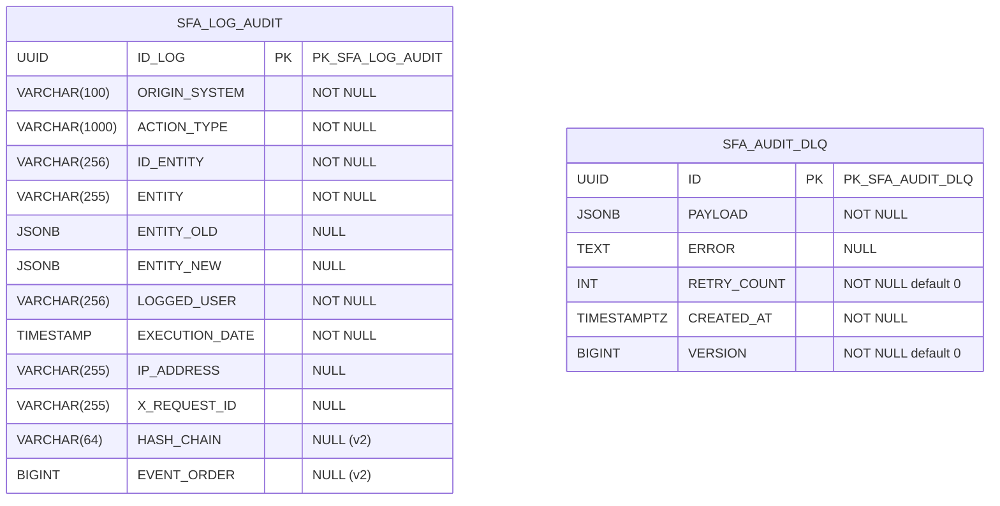

# Diagrama do banco de dados — módulo audit

Modelo gerado a partir dos changelogs Liquibase:

- `db/changelog/audit/init/create_db.yml` (tag `INIT`)
- `db/changelog/audit/v2/audit_accountability.yml`

> `${UUIDType}` resolve para o tipo UUID nativo conforme o SGBD (`mysql`, `postgresql`).

## Diagrama ER

> Sem chave estrangeira entre as tabelas. `SFA_AUDIT_DLQ` armazena payloads de auditoria que falharam no processamento (dead-letter queue).

## SFA_LOG_AUDIT

Registro imutável de auditoria. Encadeamento por hash (`HASH_CHAIN` + `EVENT_ORDER`) garante integridade/accountability (v2).

| Coluna | Tipo | Nulo | Notas |
|---|---|---|---|
| ID_LOG | UUID | NÃO | PK (`PK_SFA_LOG_AUDIT`) |
| ORIGIN_SYSTEM | VARCHAR(100) | NÃO | Sistema de origem |
| ACTION_TYPE | VARCHAR(1000) | NÃO | Tipo de ação |
| ID_ENTITY | VARCHAR(256) | NÃO | ID da entidade auditada |
| ENTITY | VARCHAR(255) | NÃO | Nome da entidade |
| ENTITY_OLD | JSONB | SIM | Estado anterior |
| ENTITY_NEW | JSONB | SIM | Estado novo |
| LOGGED_USER | VARCHAR(256) | NÃO | Usuário responsável |
| EXECUTION_DATE | TIMESTAMP | NÃO | Data/hora da ação |
| IP_ADDRESS | VARCHAR(255) | SIM | IP de origem |
| X_REQUEST_ID | VARCHAR(255) | SIM | Correlação de requisição (MDC) |
| HASH_CHAIN | VARCHAR(64) | SIM | Hash encadeado — accountability (v2) |
| EVENT_ORDER | BIGINT | SIM | Ordem sequencial do evento (v2) |

### Índices

| Índice | Colunas | Origem |
|---|---|---|
| IDX_ILA_ORIGIN_SYSTEM | ORIGIN_SYSTEM | init |
| IDX_ILA_LOGGED_USER | LOGGED_USER | init |
| IDX_ILA_START_EXECUTION_DATE | EXECUTION_DATE | init |
| IDX_ILA_SDC_ORS | EXECUTION_DATE, ORIGIN_SYSTEM | init |
| IDX_ILA_REQUEST_ID | X_REQUEST_ID | init |
| IDX_ILA_ENTITY_ID | ENTITY, ID_ENTITY | v2 |

## SFA_AUDIT_DLQ

Dead-letter queue: payloads de auditoria que falharam, com contagem de retry e controle otimista (`VERSION`).

| Coluna | Tipo | Nulo | Notas |
|---|---|---|---|
| ID | UUID | NÃO | PK (`PK_SFA_AUDIT_DLQ`) |
| PAYLOAD | JSONB | NÃO | Payload original |
| ERROR | TEXT | SIM | Mensagem de erro |
| RETRY_COUNT | INT | NÃO | Default 0 |
| CREATED_AT | TIMESTAMPTZ | NÃO | Data de criação |
| VERSION | BIGINT | NÃO | Default 0 — lock otimista |
