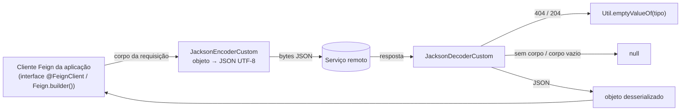

# scos-foundation-feign

Codecs Feign sobre Jackson 3 (`tools.jackson`): `JacksonEncoderCustom` e `JacksonDecoderCustom`.
Existe como módulo próprio para que quem usa só `core`/`web` **não herde `feign-core`**; depende
apenas de `core`, `feign-core` e `jackson-databind`. Substituem os codecs baseados em Gson
(migração Gson para Jackson, Story 1.3) e usam o `ObjectMapper` que você injetar, então a
serialização das chamadas Feign segue as mesmas regras do resto da aplicação.

---

## Fluxo típico de uso



---

## Uso

```java
ObjectMapper mapper = ...; // o mapper Jackson 3 da aplicação
MeuClient client = Feign.builder()
        .encoder(new JacksonEncoderCustom(mapper))
        .decoder(new JacksonDecoderCustom(mapper))
        .target(MeuClient.class, "https://servico.exemplo");
```

## Comportamento

| Situação | Resultado |
|---|---|
| `encode`: serialização falha | `EncodeException` com a `JacksonException` como causa |
| `encode`: sucesso | corpo em bytes JSON, UTF-8 |
| `decode`: status 404 ou 204 | `Util.emptyValueOf(tipo)` (lista vazia, `Optional.empty()`…), corpo não lido |
| `decode`: sem corpo ou corpo vazio | `null` |
| `decode`: `JacksonException` causada por `IOException` | a `IOException` original é relançada (erro de I/O, não de conteúdo) |
| `decode`: JSON inválido / tipo incompatível | `JacksonException` (não checada) propagada |

O Feign só chama o decoder para 404 se o cliente tiver `decode404()` habilitado; sem isso o 404
segue para o `ErrorDecoder`.

Os dois codecs são stateless e thread-safe (só guardam o `ObjectMapper`, imutável no Jackson 3).
