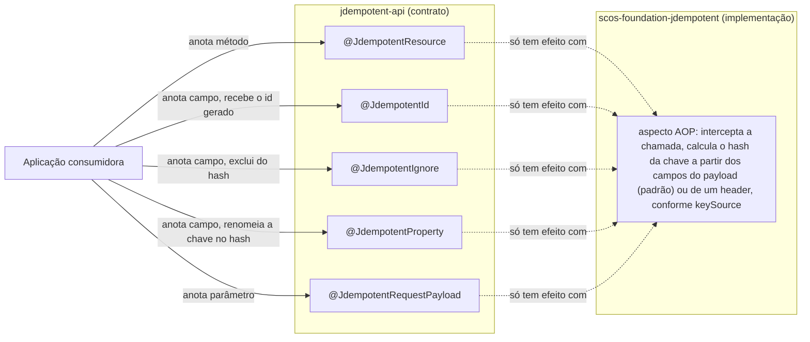

# scos-foundation-jdempotent-api

Este artefato não executa nada; a implementação é `scos-foundation-jdempotent`.

Módulo de contrato puro: contém apenas as 5 anotações `@Jdempotent*`. Sem dependência de runtime
além do JDK — pensado para um módulo de domínio (ex.: SCOS-Flow) anotar suas operações sem
carregar Redis/AOP.

Depender só deste módulo compila, mas não garante idempotência nenhuma em tempo de execução: sem
`scos-foundation-jdempotent` no classpath, não há aspecto para interceptar a chamada anotada.
Nenhum erro, nenhum aviso — inclua sempre o módulo de implementação junto.

## Fluxo típico de uso

## Conteúdo

| Tipo | Descrição |
|---|---|
| `@JdempotentResource` | Marca o método que precisa ser idempotente; carrega `cachePrefix`/`ttl`/`onBusinessException` e, desde a Story 3.13, `keySource`/`headerName`/`onMismatch` para fonte de chave via header |
| `@JdempotentId` | Recebe o identificador de idempotência gerado, no campo anotado |
| `@JdempotentIgnore` | Exclui o campo anotado do cálculo de hash da chave |
| `@JdempotentProperty` | Customiza como um campo entra no cálculo de hash da chave |
| `@JdempotentRequestPayload` | Marca o parâmetro do método que representa o payload da requisição idempotente |
| `KeySource` (Story 3.13) | De onde a chave é composta: `FIELDS_ONLY` (padrão) ou `HEADER_THEN_FIELDS` (lê `headerName()` primeiro) |
| `IdempotentKeyMismatchPolicy` (Story 3.13) | Política declarada para um header reenviado com payload diferente; hoje só `CONFLICT`, ver Javadoc para o que está (e não está) implementado |

## Regra de fronteira

Uma regra ArchUnit local (`ArchitectureTest`) falha o build se qualquer classe deste módulo não
for `@interface`/`enum`, ou se qualquer dependência além do JDK for introduzida.
