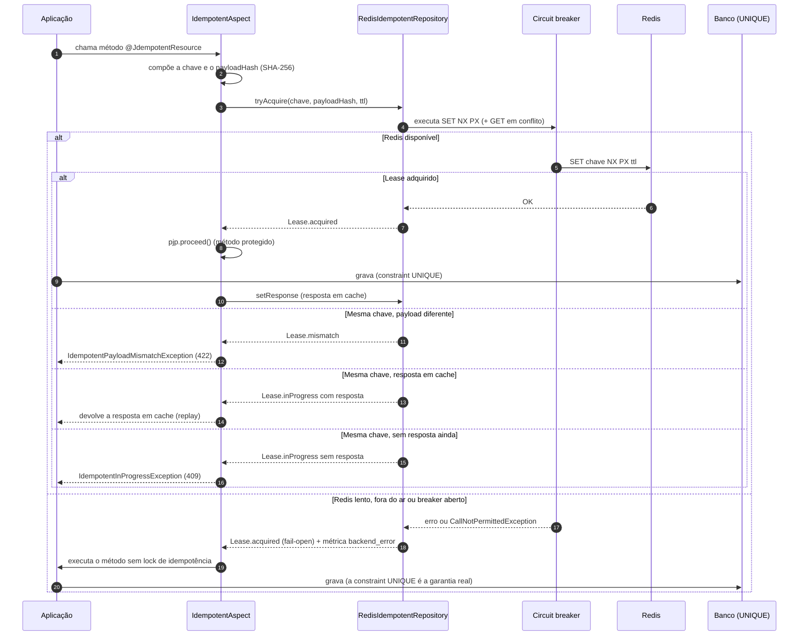

# scos-foundation-jdempotent

Módulo de idempotência para métodos anotados com `@JdempotentResource` (contrato em
`scos-foundation-jdempotent-api`). `IdempotentAspect` intercepta a chamada, adquire um lock atômico
(`tryAcquire`) num repositório (Redis ou in-memory) e, numa chamada repetida com a mesma chave,
devolve a resposta cacheada em vez de reexecutar o método protegido.

## Como configurar

O caminho normal de uso é a auto-configuração Spring Boot (`ScosJdempotentConfig`, ativada por
`scos.jdempotent.enabled=true`, padrão) — ver o exemplo completo de `application.yml` e anotações
no README da raiz do repositório. Nenhuma instanciação manual é necessária nesse caminho.

Para montar um `IdempotentAspect` fora do Spring (testes, uso programático), use o builder — não há
mais construtores públicos (Story 3.17: os 7 construtores telescópicos anteriores, combinando
`IdempotentRepository`/`ErrorConditionalCallback`/`DefaultKeyGenerator` em todas as combinações,
foram substituídos por esta API fluente):

```java
IdempotentAspect aspect = IdempotentAspect.builder()
        .repository(new RedisIdempotentRepository(redisTemplate, redisProperties, metrics)) // opcional, padrão: InMemoryIdempotentRepository
        .errorCallback(myErrorCallback)                                                     // opcional, padrão: nenhum
        .keyGenerator(new DefaultKeyGenerator(namespace))                                    // opcional, padrão: DefaultKeyGenerator sem namespace
        .build();
```

## Fluxo de aquisição do lock (`tryAcquire` -> `Lease` -> fail-open)



Ordem de decisão em `IdempotentAspect.execute` quando o lease **não** é adquirido: colisão de
payload (`isMismatch()`) vence tudo; depois resposta em cache (replay, ou relançamento da falha
guardada); por fim "em andamento". Sob falha do Redis o `RedisIdempotentRepository` nunca lança:
devolve um lease adquirido, logo o fail-open acontece dentro do repositório, não no aspecto.

A aquisição é um único `SET chave valor NX PX <ttl>` (sem script Lua): exatamente um chamador
concorrente vê `acquired == true`. O `GET` que descreve a chave em conflito não é atômico com o
`SET` e pode estar levemente defasado.

## Contrato

- **Chave**: `[namespace-][cachePrefix-]<hex SHA-256 do payload>`. O `namespace` vem de
  `scos.jdempotent.namespace` (obrigatório, sem default: a aplicação não sobe sem ele). Campos do
  payload entram ordenados por nome; `@JdempotentIgnore` e `@JdempotentId` excluem o campo,
  `@JdempotentProperty` renomeia. Com `keySource = HEADER_THEN_FIELDS` a chave vem do header
  `headerName` (exige `cachePrefix` e `headerName` não vazios) e cai para os campos se o header
  faltar ou não houver contexto web.
- **TTL**: `@JdempotentResource(ttl, ttlTimeUnit)`; `ttl = 0` usa
  `scos.jdempotent.cache.redis.expirationTimeHour` no Redis e nunca expira no repositório em memória.
- **Exceções** (o módulo não depende de `web`; o mapeamento HTTP é do consumidor, tipicamente
  409 e 422):

  | Situação | Exceção |
  |---|---|
  | mesma chave, chamada ainda em andamento | `IdempotentInProgressException` |
  | mesma chave, payload diferente | `IdempotentPayloadMismatchException` |
  | retry de chamada que falhou sob `KEEP_FAILED` | `IdempotentReplayedFailureException` (só classe e mensagem da falha original sobrevivem) |

- **Política de falha de negócio** (`onBusinessException`): `RELEASE` (padrão) remove a chave e o
  retry reexecuta; `KEEP_FAILED` guarda a falha codificada como `String` e o retry a reproduz sem
  reexecutar. Só `Exception` aciona a política: um `Error` propaga sem liberar a chave, que expira
  pelo TTL.
- **`ErrorConditionalCallback`**: se `onErrorCondition(resposta)` for verdadeiro, a chave é
  removida e `onErrorCustomException()` é lançada.
- **Métricas** (Micrometer, se houver exatamente um `MeterRegistry`; senão no-op):
  `idempotency.acquired`, `.hit`, `.in_progress`, `.mismatch`, `.backend_error`, o gauge
  `idempotency.degraded` e `idempotency.degraded.transitions`. Falha numa implementação de
  métricas nunca afeta o fluxo de negócio.
- **Repositórios**: `RedisIdempotentRepository` (distribuído, fail-open) e
  `InMemoryIdempotentRepository` (padrão do builder, local à JVM, TTL aplicado na leitura).

## Cache é fast-path, não garantia

O Redis (ou o repositório in-memory) usado pelo `jdempotent` é um mecanismo de **fast-path para
evitar reprocessamento**, não a garantia final contra duplicidade. Ele funciona bem no caminho
feliz, mas falha de forma aberta (fail-open, Story 3.7): se o Redis está indisponível ou lento, o
circuit breaker interrompe rápido e a requisição de negócio **prossegue sem o lock de idempotência**
— nunca `FAIL_CLOSED`.

Isso cria um cenário de split-brain concreto e já catalogado (Story 3.7, AC #3): o lock é adquirido
com sucesso (Redis up), o Redis cai durante o processamento do método protegido, `setResponse`
falha silenciosamente — a chamada ainda retorna sucesso ao cliente, mas a resposta **não fica
cacheada**, e um retry subsequente do cliente **reexecuta o método de negócio** do zero.

A garantia real contra duplicidade nesse cenário de falha (e, na prática, em qualquer cenário) é a
constraint `UNIQUE` do banco de dados sobre a chave de negócio (NFR6) — **não** o cache de
idempotência. Todo método com chave de idempotência natural (ex.: `transactionId`, número de
pedido) deve ter essa constraint `UNIQUE` no banco **antes** de habilitar `@JdempotentResource`
sobre ele. Sem ela, o cenário de split-brain acima produz um registro duplicado de verdade — o
`jdempotent` reduz a frequência com que isso acontece, não a elimina.

## Relação entre os timeouts

O módulo depende de três valores de tempo:

1. **`ttl` do lease** (`@JdempotentResource(ttl = ...)`, Story 3.5) — por quanto tempo uma chave
   fica marcada como "em processamento".
2. **`slow-call-duration-threshold` do circuit breaker** (Story 3.7) — a partir de quando uma
   chamada ao Redis conta como lenta. É derivado do timeout de comando da conexão Lettuce do
   próprio módulo (com fallback de 5 s se não for resolvível).
3. **Timeout de comando do cliente Redis** — hoje fixo em 5 s em `ScosJdempotentRedisConfiguration`
   (conexão: 3 s); **não** é lido de `spring.data.redis.timeout`. Como o limiar do breaker é
   derivado dele, na prática os itens 2 e 3 são iguais.

Invariante que o consumidor deve respeitar: **`ttl` do lease > timeout de comando do Redis**, com
margem e também sobre o tempo real do método protegido. Se o `ttl` expirar antes de o método
terminar, uma segunda chamada concorrente adquire um novo lease sobre a mesma chave enquanto a
primeira ainda executa (risco aceito na Story 3.5, AC #4; a métrica `idempotency.in_progress` é o
sinal de detecção em produção). Manter o `ttl` bem acima reduz, mas não elimina, essa janela.

O dimensionamento exato do `ttl` é do time consumidor (OQ-3 do PRD): depende do perfil de latência
de cada aplicação; este módulo não fixa valores.
