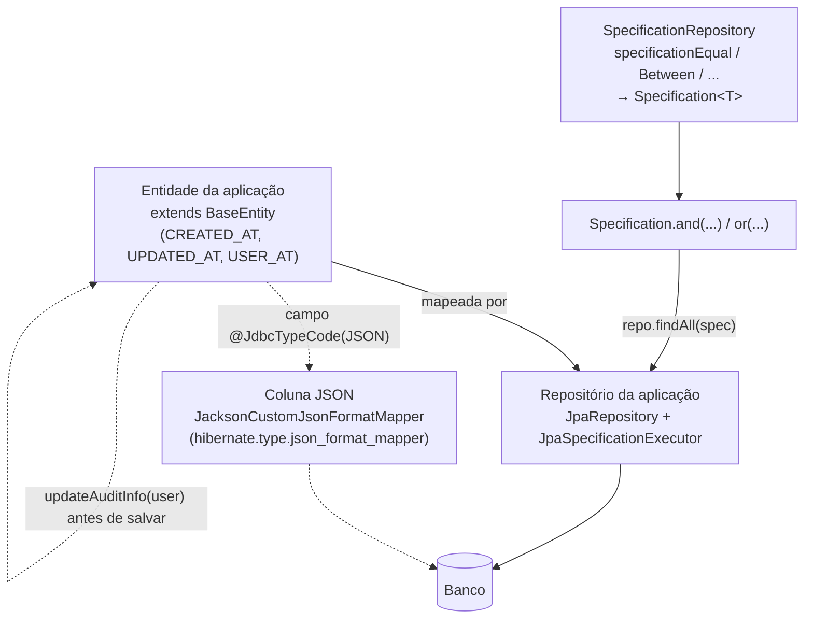

# scos-foundation-jpa

Suporte JPA/Hibernate para aplicações SCOS: `SpecificationRepository` (consultas dinâmicas),
`BaseEntity` (colunas de auditoria), `JacksonCustomJsonFormatMapper` (colunas JSON via Jackson 3) e
`BaseLiquibaseProperties` (propriedades base do Liquibase). Existe para quem só quer persistência
**sem herdar Redis/Feign** (antes essas classes viviam em `utils`). Depende de `core` e
`validation`, `spring-boot-starter-data-jpa`, `querydsl-jpa` e, opcionalmente, `liquibase-core`.

---

## Fluxo típico de uso



---

## `SpecificationRepository`

Fábrica estática de `Specification<T>` por **nome de atributo da entidade** (não da coluna):
`specificationEqual(field, value)`, `specificationBetween`, `...GreaterThanOrEqualTo`,
`...LessThanOrEqualTo` (datas `LocalDate`), `specificationEqual(field, SpecificationFunction, value)`
(função SQL sobre a coluna, p.ex. `MONTH(data) = 5`) e `specificationEqual(value, "a", "b")`
(atributo aninhado `a.b`). Arestas reais: nome de atributo inválido só falha ao executar a consulta;
`value == null` na forma com função lança `NullPointerException`; caminho vazio lança
`IndexOutOfBoundsException`; igualdade com `null` gera `= NULL` (nunca casa).

```java
Specification<Fatura> spec = SpecificationRepository.<Fatura>specificationEqual("status", ABERTA)
        .and(SpecificationRepository.specificationBetween("vencimento", ini, fim));
faturaRepository.findAll(spec);
```

## `BaseEntity`

`@MappedSuperclass` com `createdAt`/`updatedAt` (Hibernate: `@CreationTimestamp`/`@UpdateTimestamp`)
e `userAt`, **manual** via `updateAuditInfo(user)`. O `AuditingEntityListener` está registrado, mas
sem `@CreatedBy`/`@LastModifiedBy` ele não preenche `userAt`.

## `JacksonCustomJsonFormatMapper`

`FormatMapper` do Hibernate com Jackson 3 (`tools.jackson`), existente após a migração Gson→Jackson
(Story 1.3). Ativação manual:

```yaml
spring.jpa.properties.hibernate.type.json_format_mapper: br.com.sawcunhaos.foundation.jpa.hibernate.JacksonCustomJsonFormatMapper
```

O construtor sem argumentos usa um `ObjectMapper` padrão, **sem** a configuração do `ObjectMapper`
do Spring.

## `BaseLiquibaseProperties`

Classe abstrata de propriedades (Lombok `@Data`) para estender com `@ConfigurationProperties`
(exemplo: `ScosAuditLiquibaseProperties` em `audit`). Só carrega valores; vários campos
(diff, multi-tenant, rollback, formatos) são declarativos, sem efeito próprio. `validate()` **não**
é chamado automaticamente; `dropFirst` só é aceito se a propriedade de sistema
`spring.profiles.active` contiver `dev`/`local` (substring; não lê o `Environment` do Spring).
