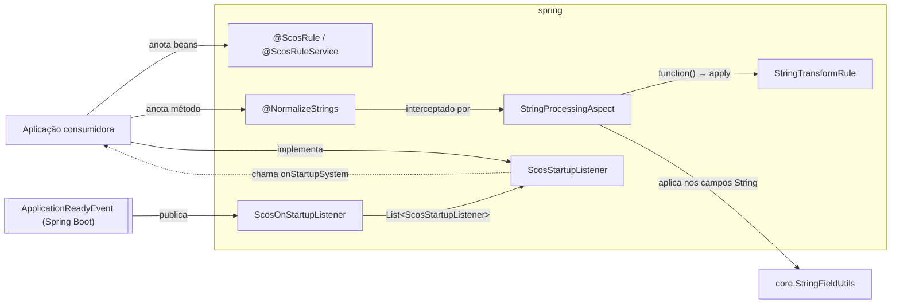

# scos-foundation-spring

Aspectos e estereótipos genéricos do Spring para o ecossistema SCOS: a anotação `@ScosRule`
(bean ordenado), `@NormalizeStrings` (normaliza campos `String` dos argumentos de um método) e o
dispatcher de startup `ScosOnStartupListener`. Depende só de `core` + `spring-context`/`spring-aop`/
`spring-boot`/`aspectjweaver`. Uma regra ArchUnit local (`ArchitectureTest`) barra qualquer classe
do módulo de depender de `jakarta.servlet..`, `jakarta.persistence..` ou `org.springframework.data..`,
para que quem consome só `@ScosRule` não herde JPA/Servlet.

> O módulo **não** traz auto-configuração: os beans (`ScosOnStartupListener`, `StringProcessingAspect`)
> só existem se a aplicação consumidora escanear `br.com.sawcunhaos.foundation.spring`.

---

## Fluxo típico de uso



---

## Dependência

```xml
<dependency>
    <groupId>br.com.sawcunhaos</groupId>
    <artifactId>scos-foundation-spring</artifactId>
</dependency>
```

---

## `@ScosRule` e `@ScosRuleService`

`@ScosRule(n)` = `@Component` + `@Order(n)` (o `value` é alias de `@Order.value`; padrão
`LOWEST_PRECEDENCE`). Serve para regras injetadas como `List<Regra>`: menor valor roda primeiro.
`@ScosRuleService` é só um `@Component` nomeado, sem ordem.

```java
@ScosRule(10)
class RegraDocumento implements Regra { ... }
```

## `@NormalizeStrings`

```java
@NormalizeStrings(function = StringTransformRule.CAPITALIZE)
public void salvar(PessoaDto dto) { ... } // dto.nome já chega capitalizado
```

Limites (vêm de `StringFieldUtils.applyTransformation`):

- só a chamada **através do proxy** do Spring é interceptada (chamada interna na mesma classe, não);
- só campos `String` declarados **diretamente** na classe do argumento — herdados, objetos aninhados
  e coleções não são tocados; um argumento `String` puro é imutável e não muda;
- o objeto é alterado **in place**, via reflexão (ignora setters).

`StringTransformRule`: `UPPER_CASE` (padrão), `LOWER_CASE`, `CAPITALIZE` (cada palavra) e `CAMEL_CASE`
(hoje equivale a `LOWER_CASE`: não remove espaços).

## `ScosStartupListener`

A aplicação implementa a interface como bean; `ScosOnStartupListener` (`@Order(1)`) injeta todos
(`List`, `null` se não houver nenhum) e chama `onStartupSystem(event)` em `ApplicationReadyEvent`.
Uma exceção em um listener interrompe os seguintes.
