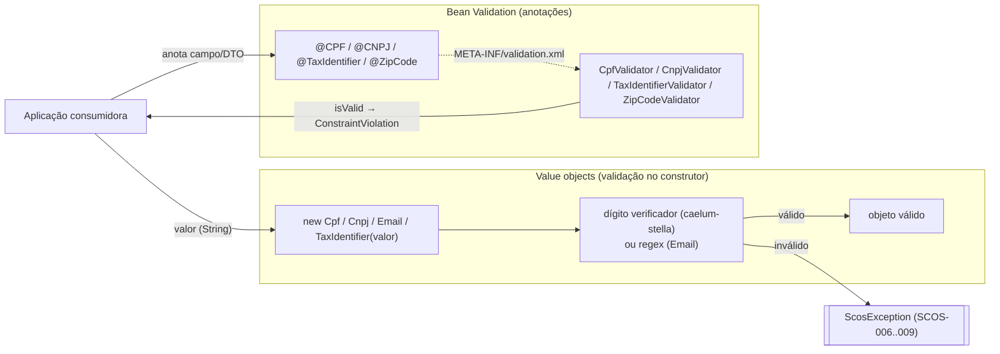

# scos-foundation-validation

Value objects e validadores de documentos brasileiros: `Cpf`, `Cnpj`, `Email` e `TaxIdentifier`
(CPF ou CNPJ), mais os `ConstraintValidator`s que implementam as anotações `@CPF`, `@CNPJ`,
`@TaxIdentifier` e `@ZipCode`. Existe para validar um documento sem puxar a stack JPA/Spring
completa. Depende de `core` (`ScosException`/`ScosExceptionCode`), `validation-api` e
`caelum-stella-core` (algoritmos de dígito verificador); `jakarta.persistence-api` é `provided`.

---

## Relação com `validation-api` e com JPA

- **`validation-api`** só tem as anotações (contrato). **Este módulo** tem a implementação: os
  value objects e os `ConstraintValidator`s. A ligação anotação → validador é feita em tempo de
  execução pelo `META-INF/validation.xml` + `validation-constraint-mappings.xml` deste módulo
  (as anotações declaram `validatedBy = {}` para evitar um ciclo de módulos). Sem este módulo no
  classpath, `@CPF` etc. compilam mas não validam nada.
- **`jakarta.persistence-api` é `provided`**: os value objects são `@Embeddable`, mas só quem de
  fato persiste os tipos precisa trazer JPA. Quem só chama `new Cpf(valor)` não herda JPA.

---

## Fluxo típico de uso



---

## Value objects

| Classe | Aceita | Erro (`ScosException`) |
|---|---|---|
| `Cpf` | 11 dígitos, sem pontuação | `CPF_INVALID` (`SCOS-007`) |
| `Cnpj` | 14 dígitos, sem pontuação | `CNPJ_INVALID` (`SCOS-008`) |
| `TaxIdentifier` | CPF **ou** CNPJ, sem pontuação (tenta CNPJ, depois CPF) | `TAX_IDENTIFIER_INVALID` (`SCOS-006`) |
| `Email` | regex `local@dominio.tld` (TLD ≥ 2 letras), sem `..`, `.@` ou ponto inicial; não é RFC 5322 completo | `EMAIL_INVALID` (`SCOS-009`) |

```java
Cpf cpf = new Cpf("11144477735");   // ok; cpf.getType() == "CPF"
new Cpf("111.444.777-35");          // ScosException: formatado é rejeitado
```

Pontos que surpreendem:

- **Valor formatado é rejeitado** (`111.444.777-35`, `11.222.333/0001-81`); normalize antes.
- **Não são imutáveis**: há setter (reaplica a mesma validação; em caso de falha mantém o valor
  anterior). Em `Cpf`/`Cnpj` o setter se chama `setTaxIdentifier` (nome herdado de cópia).
- **`null`** viola o contrato `@NonNull` e falha com exceção não verificada que **não** é
  `ScosException`.
- `getType()` (`"CPF"`/`"CNPJ"`) é `@Transient`: recalculado a cada validação, não persistido.

## Validadores de anotação

`@CPF`, `@CNPJ` e `@TaxIdentifier` aplicam as mesmas regras dos value objects. `@ZipCode`
(`ZipCodeValidator`) confere só o formato do CEP (`01001000` ou `01001-000`), não a existência.
Nenhum aceita `null` como válido (diferente da convenção usual do Bean Validation).
