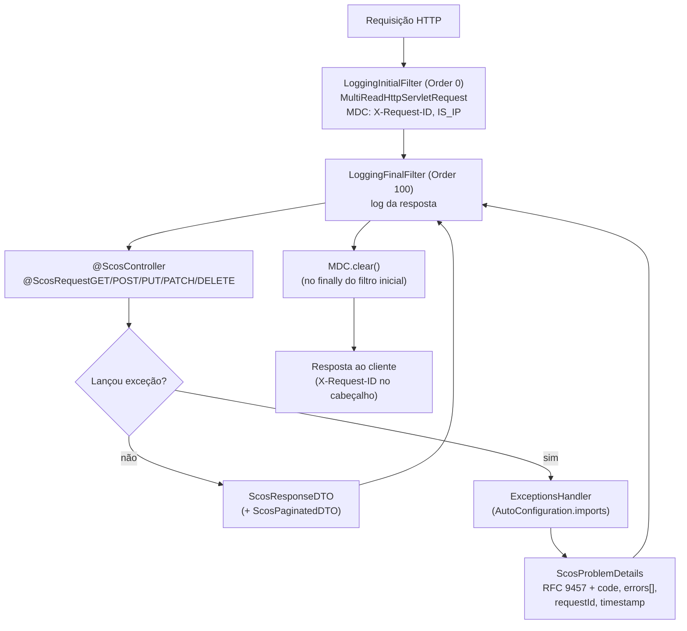

# scos-foundation-web

Camada HTTP para aplicações SCOS: o estereótipo `@ScosController` e as anotações de rota
`@ScosRequestGET/POST/PUT/PATCH/DELETE` (com `@Cacheable`/`@CacheEvict` embutidos), os filtros de log de
requisição/resposta com `X-Request-ID` no MDC, o envelope de resposta (`ScosResponseDTO`) e paginação, e
o **tratamento de erro HTTP automático** em RFC 9457 (`ExceptionsHandler`). Depende de `core`, `cache` e
`privacy` (mascaramento de PII nos logs), além de Spring Web, Spring Data Commons e Jackson 3. O antigo
módulo `exception` foi absorvido aqui (HTTP) e em `core` (contrato de domínio).

---

## Fluxo típico de uso



O `LoggingFinalFilter` envolve o controller e a resposta é lida depois que a cadeia termina; o
`MDC.clear()` fica no `finally` do filtro inicial, o mais externo.

---

## Ativação: o que é automático e o que não é

- **Automático** (`AutoConfiguration.imports`): `ScosWebErrorHandlerAutoConfiguration`
  (registra o `ExceptionsHandler`) e `ScosMessageSourceConfiguration` (agrega os bundles
  `scos_message/*.properties`).
- **Por component scan:** filtros, `ScosFilterProperties`, `IpAddressExtractor`, `ScosJacksonConfig` e
  `ValidationAnnotationCountListener` são `@Configuration`/`@Component` comuns. Só entram se o pacote
  `br.com.sawcunhaos.foundation.web` estiver no scan da aplicação (ex.:
  `@ComponentScan(basePackages = "br.com.sawcunhaos")`, como no README raiz). Sem isso o erro RFC 9457
  funciona, mas não há log de requisição nem `requestId`.

---

## Tratamento de erro (RFC 9457)

Toda resposta de erro é `application/problem+json` com `type`, `title`, `status`, `detail`, `instance` e as
extensões `code`, `errors[]` (validação), `requestId` (do MDC, quando houver) e `timestamp`.

| Origem | Status | `code` |
|---|---|---|
| `ScosException` / `ScosNoRollbackException` | o `httpCode` da exceção (inválido vira 400) | o da exceção |
| `ScosNoContentException` | 204, sem corpo | - |
| `@Valid` (corpo), `HandlerMethodValidationException`, `ConstraintViolationException` | 400, com `errors[]` | `ATTRIBUTE_NOT_VALID` |
| Corpo ilegível / valor de enum inválido | 400 | `ENUM_ERROR` |
| `AccessDeniedException` / `AuthorizationDeniedException` | 403 | `ACCESS_DENIED` |
| `MethodNotImplementedException` | 501 | `NOT_IMPLEMENTED` |
| Rota inexistente, método não suportado, etc. (hook `handleExceptionInternal`) | o do Spring | `GENERIC` |
| Qualquer outra | 500, mensagem genérica | `GENERIC` |

Cada item de `errors[]` é um `ScosFieldError` (`pointer` JSON Pointer como `#/address/street`, `detail`
localizado, `code`, `type`).

**Property:** `scos.web.error-handler.enabled` (padrão `true`, inclusive ausente). Com `false` o handler não
é registrado. O bean tem `@Order(LOWEST_PRECEDENCE)`, então um `@ControllerAdvice` da aplicação com ordem
mais alta prevalece.

---

## Anotações de rota e cache

`@ScosController` = `@RestController` + prefixo `/api` + `produces = application/json`. As anotações
`@ScosRequest*` combinam `@RequestMapping`, `@ResponseStatus` e cache; `uri` e `httpCode` são obrigatórios.

| Anotação | Cache embutido | `consumes` |
|---|---|---|
| `@ScosRequestGET` | `@Cacheable`, `keyGenerator = "ScosCacheKeyGenerator"` (do módulo `cache`) | - |
| `@ScosRequestPOST/PUT/PATCH` | `@CacheEvict(allEntries = true)` | `application/json` |
| `@ScosRequestDELETE` | `@CacheEvict(allEntries = true)` | - |

O cache vem **desligado por padrão**: `nameCache = "DISABLE"` e `condition = "false"`. Para cachear um
`GET`, informe um `nameCache` real e `condition` (SpEL) verdadeira; para a escrita limpar o cache, o
mesmo `nameCache` e `condition = "true"`.

```java
@ScosController
class ClienteController {
    @ScosRequestGET(uri = "/clientes/{id}", httpCode = HttpStatus.OK,
                    nameCache = "clientes", condition = "true")
    ScosResponseDTO<ClienteDTO> buscar(@PathVariable Long id) { ... }

    @ScosRequestPUT(uri = "/clientes/{id}", httpCode = HttpStatus.OK,
                    nameCache = "clientes", condition = "true")
    ScosResponseDTO<ClienteDTO> atualizar(...) { ... }
}
```

---

## Filtros de log

`LoggingInitialFilter` (`Order 0`) sempre preenche `X-Request-ID` (reaproveita o do cliente ou gera um UUID) e
`IS_IP` no MDC e devolve o `X-Request-ID` no cabeçalho. Só para URIs que **contêm** `/api` (ou
`<context-path>/api`) ele loga "Initial API Call" e `LoggingFinalFilter` (`Order 100`) loga "Final API Call".
Corpo e cabeçalhos passam pelo mascaramento do `privacy` e, por padrão, **não** são logados:

| Property | Padrão | Efeito |
|---|---|---|
| `server.filter.show-request-body` | `false` | loga o corpo da requisição |
| `server.filter.show-request-headers` | `false` | loga os cabeçalhos |
| `server.filter.show-response-body` | `false` | loga o corpo da resposta |

`MultiReadHttpServletRequest` copia o corpo para a memória na primeira leitura, para o filtro logar e o
controller ainda poder ler. Requisições `application/grpc` são ignoradas.

---

## Utilitários

- `ScosResponseUtils.wrapResponse(...)` e `PaginationUtils`: envelope e `Pageable`. A página do cliente é
  **1-based** (o Spring é 0-based); `ScosPaginationFilterDTO` assume página 1, 10 itens, `ASC`.
- `JacksonXmlUtils.getInstance()`: `XmlMapper` compartilhado e tolerante. `ScosJacksonConfig`: o `JsonMapper`
  ignora propriedade desconhecida e `null` em primitivo.
- `ValidationAnnotationCountListener`: no `ApplicationReadyEvent`, loga quantos campos `@CPF/@CNPJ/@TaxIdentifier/@ZipCode` existem.

---

## Comportamentos a conhecer

- `IpAddressExtractor` confia nos cabeçalhos de proxy sem checar a origem (forjáveis), valida com
  `InetAddress.getByName` (pode resolver DNS) e remove a "porta" com `split(":")`, o que não trata IPv6.
- `MultiReadHttpServletRequest` guarda o corpo inteiro em memória, sem limite.
- Sem `condition`, as anotações `@ScosRequest*` não cacheiam nem limpam cache.
